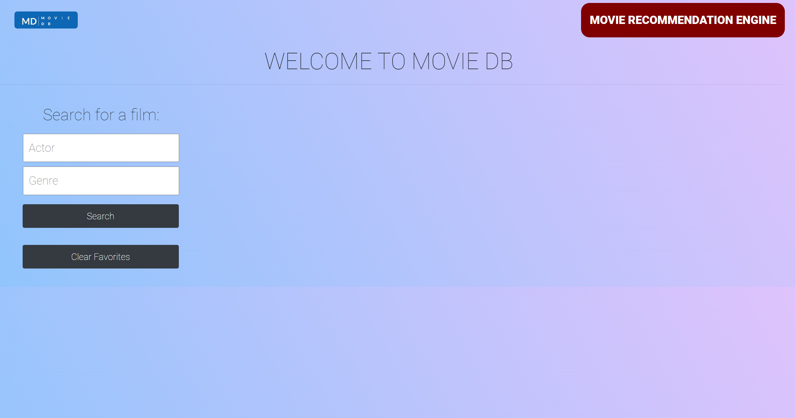

# Movie_DB_Project

## Description

Movie DB will suggest a movie based on the user's inputted criteria. It will return a movie name, a poster, a summary of the plot, a rating and a trailer. 

The user can also saved movies to a list of favourites to watch later

## Installation

No installation necessary! However an internet browser is required and Google Chrome is reccomended. Link to website is: https://amarmalde.github.io/Work-Day-Scheduler/ and it should look similar to the below image.

## Credits

Website made using The Movie Database's & YouTube's Data APIs.